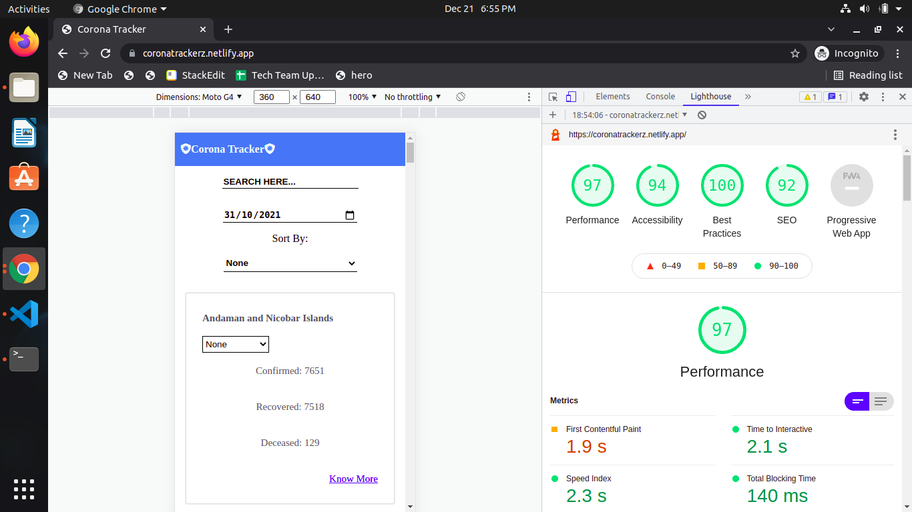
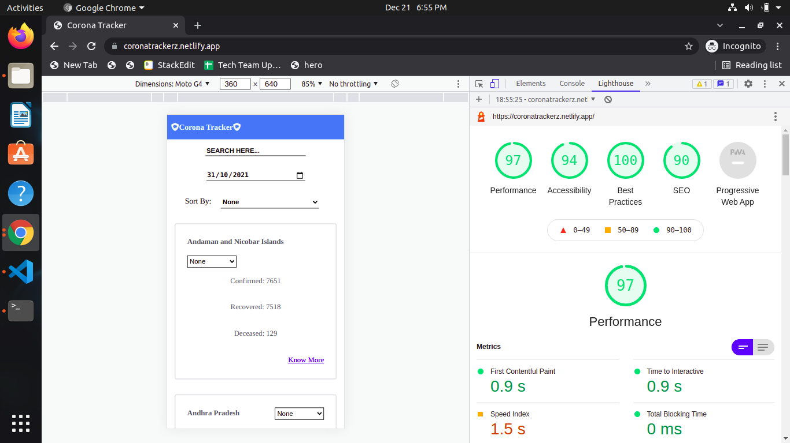
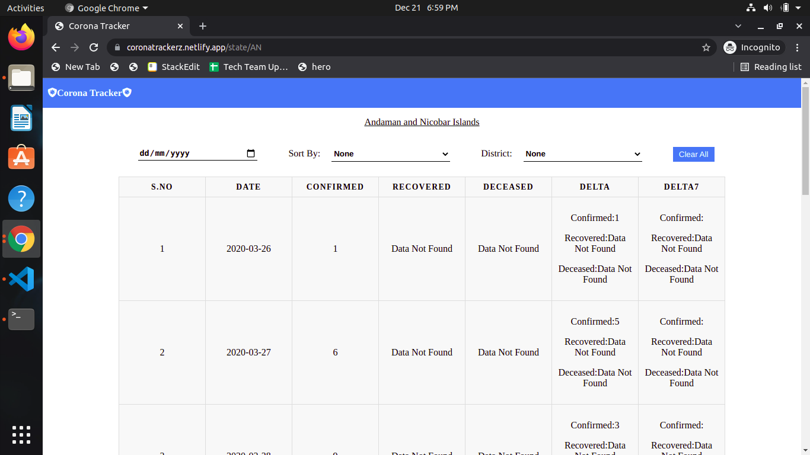

# coronatracker2.0

It is new version of corona tracker
 

## How i build this?

A new corona tracker build with react used covid19 india API (https://data.covid19india.org)

## what are the featurs implemented on home page?

  <ul>
 <li> States Names are Alphabeticaly listed by default.</li>
 <li> Search will filter the states based on name.(If No Data match the filter Result not found UI will be shown)</li>
 <li> List has Date Filter. On selecting a Date, stats for that particular date will
be reflected in all State card. </li>
 <li> List has option to sort states by<li>
  <ol>
   <li> 1. Confirmed count Ascending/Descending.</li>
   <li> 2. Affected Percentage Ascending/Descending.</li>
    <li>3. Vaccinated percentage Ascending/Descending. </li>
  </ol>
 <li> On selecting a district, corrosponding district stats will
be displayed in the card.</li>
 <li>Can be navigated through left/right arrows. Total,
Delta, Delta7 stats will be displayed in those pages</li>
  <li>Data are cached on local storage for faster access</li>
 </ul>
 
 ## what are the featurs implemented on state detail page?
   <ul>
 <li> Date and sort by and District filters are applicable.</li>
 <li> If No Data match the filter Result not found UI will be shown.</li>
 <li> Data are stored on cache state beacuse the data is more then 5MB.</li>
 </ul>
 
 ## what are the featurs that i implement my own?
 <ul>
 <li>For some states anddistricts the data is not avalible for that it will shown data not found in UI.</li>
 <li>Optimized state detail page by using pagination to avoid rendering a huge list in same page.</li>
 <li>It is responsive</li>
 <li>Optimized the state card only render the districts in state card if user focus on the selcect html element on state card.</li>
 <li>Network Error are handled.</li>
 <li>Checked the performance of the website using light house and improved some it.</li>

For Mobile

For Desktop

  

</ul>
 
 ## what are the things i learned form it ?

 <ul>
  <li>Use pagination or onscroll render when we rendering huge list.</li>
  <li>Re use the code as much as possible.</li>
  <li>Code readablity is very much important.</li>
  <li>Avoid unwanted network request try to cache it.</li>
  <li>How to sort nested objects based on some value.</li>
  <li>How to sort nested objects based on some value.</li>
  <li>Object.keys() function not return in object created order.</li>

 </ul>

## what are the problems i face during the development?

 <ul>
  <li>Object.keys()-> this function not return in object created order which makes me harder find what wrong in my code when i sorting in state detail page i used debugger to find what's the problem then i pass the states_date to table to resolve that issues</li>
  <li>the json return by API endpoints are too nested which cause me lot of problems excatly i don't remember what but i overcome it some how.
  </li>
  <li>
  For some state the date is missing which cause me problems while sorting to avoid that i append empty data with 0 value
  </li>
  <li>When implementing pagenation i face lot of issues because when user applying the filter it casue me a problem in UI.finally i overcome that by implementing useEffect that runs when user use filter options.</li>
  <li>When deploying the website in netlify the react router won't work when refresh in page /state/:State_name to avoid that i add _redirects file in public folder .</li>
 </ul>

## website preview
 
 <h4>Website Depolyed in <a href="https://coronatrackerz.netlify.app/">netlify</a>(https://coronatrackerz.netlify.app/)</h4>
  

